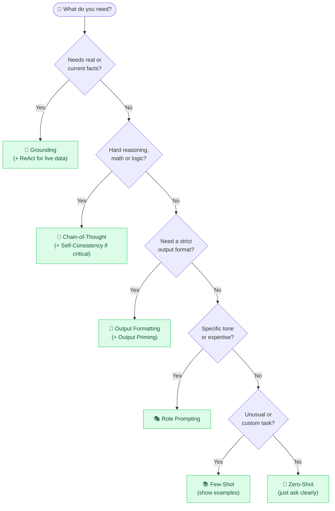

# 🧠 Prompt Engineering — Visual Edition

### Get better answers from AI — with prompts you can copy today.

**Simple visuals + everyday analogies + copy-paste templates that turn anyone into a confident prompter — whether you write code or just chat with ChatGPT.**

*If this helps you finally write prompts that work — drop a ⭐. It helps more people find it.*

---

## 🤔 Why this exists

Everyone's using AI, but most people are leaving **80% of its power on the table** — because nobody taught them how to *ask*. The guides out there are either **academic papers** or **"10 magic prompts" clickbait**.

This repo sits in the middle. Every technique gets:

- 🧒 **An "Explain Like I'm 5" analogy** — the one-liner you'll actually remember
- 🖼️ **A simple diagram** — see how the technique works, don't just read it
- 🔧 **"How it actually works"** — for when you're ready to go deeper
- 🌍 **A real-world example** — where it actually helps

No PhD required. No prior coding needed. Just better results from the AI you already use.

---

## 🧭 Which technique should I use?

> Lost? Start here. Follow the arrows to the right tool for your task.

---

## 📚 The Techniques

### 🌱 Start here — the everyday essentials

| # | Technique | One-liner |
|---|-----------|-----------|
| 1 | [🎯 Zero-Shot Prompting](techniques/zero-shot.md) | Just ask — no examples needed. |
| 2 | [📚 Few-Shot Prompting](techniques/few-shot.md) | Show 2–3 examples and let it copy the pattern. |
| 3 | [🎭 Role Prompting](techniques/role-prompting.md) | Give the AI a job title before you ask. |
| 4 | [📐 Clear Instructions](techniques/clear-instructions.md) | Vague in, vague out — be specific. |
| 5 | [🧾 Output Formatting](techniques/output-format.md) | Tell it the *shape* you want: list, table, JSON. |
| 6 | [🚦 Constraints & Negatives](techniques/constraints.md) | Set the boundaries it can't cross. |
| 7 | [✍️ Output Priming](techniques/output-priming.md) | Start the answer for it; it finishes the pattern. |
| 8 | [🖼️ Multimodal Prompting](techniques/multimodal-prompting.md) | Prompt with images, not just words. |

### ⚙️ Level up — reasoning & reliability

| # | Technique | One-liner |
|---|-----------|-----------|
| 9 | [🔗 Chain-of-Thought](techniques/chain-of-thought.md) | Ask it to "think step by step." |
| 10 | [🪜 Step-Back Prompting](techniques/step-back.md) | Get the general principle first, then the answer. |
| 11 | [🧗 Least-to-Most](techniques/least-to-most.md) | Solve the easy sub-problems first, then climb. |
| 12 | [🌳 Tree of Thoughts](techniques/tree-of-thoughts.md) | Explore several branches, keep the best. |
| 13 | [🗳️ Self-Consistency](techniques/self-consistency.md) | Ask a few times, take the majority answer. |
| 14 | [🔍 Self-Critique & Reflection](techniques/self-critique.md) | Have it grade and fix its own work. |
| 15 | [🔄 Iterative Refinement](techniques/iterative-refinement.md) | Treat the first answer as a draft, then steer. |
| 16 | [📖 Grounding (Answer from Context)](techniques/grounding.md) | Make it answer only from facts you supply. |

### 🤖 Power tools — building with prompts

| # | Technique | One-liner |
|---|-----------|-----------|
| 17 | [🚧 Delimiters & Structure](techniques/delimiters.md) | Fence off your content so it's never confused. |
| 18 | [⛓️ Prompt Chaining](techniques/prompt-chaining.md) | Break big jobs into a chain of small prompts. |
| 19 | [🔁 ReAct (Reason + Act)](techniques/react.md) | Think → act → observe → repeat. |
| 20 | [🪪 System Prompt](techniques/system-prompt.md) | The hidden rulebook behind every AI app. |
| 21 | [🪞 Meta-Prompting](techniques/meta-prompting.md) | Ask the AI to write your prompt for you. |
| 22 | [🧱 Prompt Templates](techniques/prompt-templates.md) | Write it once with blanks, reuse forever. |

### 🛡️ Don't get burned — pitfalls

| # | Technique | One-liner |
|---|-----------|-----------|
| 23 | [🌀 Avoiding Hallucinations](techniques/avoid-hallucination.md) | Stop the AI from confidently making things up. |
| 24 | [🛡️ Prompt Injection](techniques/prompt-injection.md) | The sneaky attack every prompter should know. |

---

## 🚀 The 30-second cheat sheet

> If you remember nothing else, remember this:

1. **Be specific.** Say who it's for, how long, and what format. ([more](techniques/clear-instructions.md))
2. **Give an example** when the format is unusual. ([more](techniques/few-shot.md))
3. **Assign a role.** "You are a..." reshapes the whole answer. ([more](techniques/role-prompting.md))
4. **For hard problems, say "think step by step."** ([more](techniques/chain-of-thought.md))
5. **Iterate.** The first reply is a draft, not the final word. ([more](techniques/iterative-refinement.md))

---

## 🧩 Sister project

This is the companion to **[AI for Beginners — Visual Edition](https://github.com/behnia137/ai-for-beginners-visual)** — 32 core AI concepts (LLM, token, embedding, RAG…) explained the same visual way. Learn *what AI is* there, learn *how to talk to it* here.

---

## 🤝 Contributing

Got a clearer analogy or a technique we're missing? PRs are warmly welcome — see **[CONTRIBUTING.md](CONTRIBUTING.md)**. You don't need to be an expert; if you can explain something simply, you can contribute.

---

**Made for everyone who's tired of mediocre AI answers.**

If it helped you, a ⭐ goes a long way. 🧠💛

