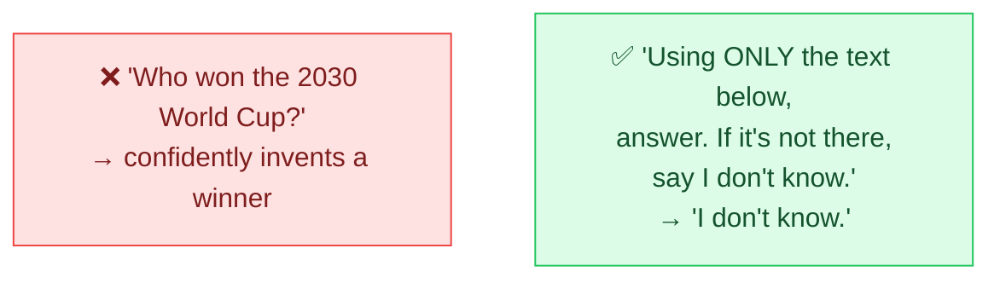

# 🌀 Avoiding Hallucinations

> **🧒 Explain Like I'm 5:** AIs sometimes make stuff up with total confidence. You can lower the odds by giving it facts and telling it that "I don't know" is allowed.

## 🖼️ The Picture

## 🔧 How it actually works

A **hallucination** is when the AI states something false as if it were true — a fake citation, a made-up statistic, a confident wrong date. It happens because the model is a fluent *guesser*: it predicts plausible-sounding text, and "plausible" isn't the same as "correct." It has no built-in fact-checker.

You can't eliminate hallucinations with prompting alone, but you can sharply reduce them:

- **Give it the facts.** Paste the source text and say "answer using only this." (This is the idea behind retrieval-augmented generation.)
- **Permit "I don't know."** Models often invent answers because they feel obligated to respond. Explicitly allowing uncertainty gives them an honest exit.
- **Ask for sources / quotes.** "Quote the exact sentence that supports your answer" exposes fabrications fast.
- **Lower the [temperature](https://github.com/behnia137/ai-for-beginners-visual/blob/main/concepts/temperature.md)** for factual tasks so the model stays conservative.
- **Verify anything that matters** — never trust unsourced numbers, names, or legal/medical claims.

## 🌍 Real-world example

A company's help bot is told: "Answer only from the provided support docs. If the answer isn't in them, say 'I'm not sure — let me connect you to a human.'" Instead of inventing a refund policy, it gracefully hands off — turning a risky guess into a trustworthy reply.

## 🔗 Related

- [Self-Consistency](self-consistency.md)
- [ReAct](react.md)
- [Delimiters & Structure](delimiters.md)
