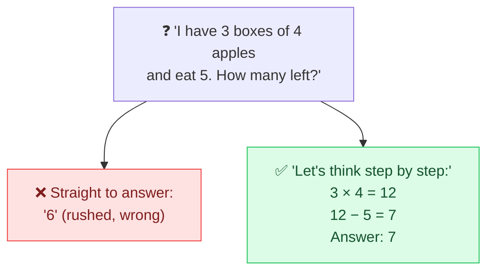

# 🔗 Chain-of-Thought Prompting

> **🧒 Explain Like I'm 5:** Ask the AI to "show its work" like in math class. Thinking step by step out loud makes it get more answers right.

## 🖼️ The Picture

## 🔧 How it actually works

**Chain-of-thought (CoT)** prompting asks the model to reason through a problem in intermediate steps *before* giving the final answer. The magic phrase is **"Let's think step by step"** — adding it reliably improves accuracy on math, logic, and multi-step questions.

Why it works: the model generates one word at a time, so writing out the reasoning gives it a "scratch space." Each step it produces becomes context that helps it produce the next step correctly — instead of forcing the whole chain of logic into one risky leap. Mistakes that would slip past in a quick answer get caught mid-thought.

Newer **reasoning models** do this automatically and internally — they spend extra compute "thinking" before answering. The trade-off is cost and speed: more reasoning means more tokens and more time. For simple lookups it's overkill; for genuinely hard problems it's the difference between a confident wrong answer and a correct one.

## 🌍 Real-world example

Ask an AI a tricky word problem and watch it walk through the logic line by line before answering — or see a "reasoning" model visibly think for a few seconds first. That's chain-of-thought making the answer trustworthy.

## 🔗 Related

- [Self-Consistency](self-consistency.md)
- [Zero-Shot Prompting](zero-shot.md)
- [ReAct](react.md)
