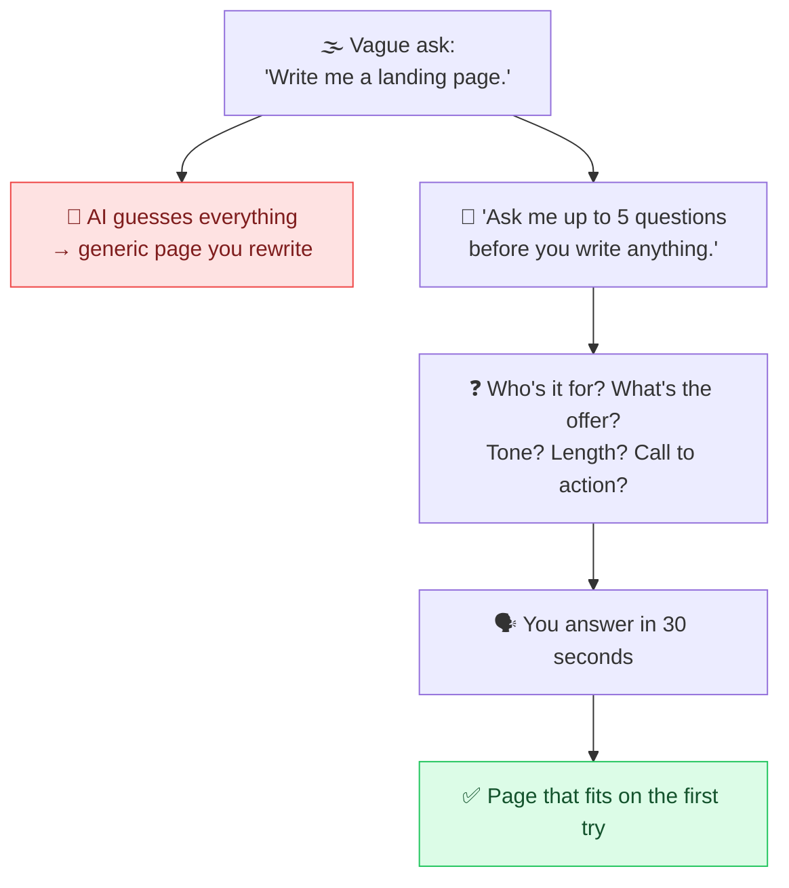

# 🙋 Clarifying Questions

> **🧒 Explain Like I'm 5:** Instead of guessing what you want, the AI asks *you* a few questions first, like a tailor measuring you before cutting the cloth.

## 🖼️ The Picture

## 🔧 How it actually works

By default a model **never asks**, it answers. Faced with a half-specified request it quietly fills the gaps with the most average assumption it can find, and you only discover the mismatch after reading 600 words you didn't want. **Clarifying questions** flip that: you explicitly grant permission (and an obligation) to interrogate you first.

The magic phrase is a single line at the end of your prompt: *"Before you answer, ask me any questions you need. Do not start until I reply."* That last clause matters, without it, many models politely list questions and then answer anyway, which defeats the point. Capping the count ("at most 5, the most important ones first") keeps it from turning into a form you'll abandon.

It works because the model is usually a far better requirements analyst than you are a spec writer. It knows which variables actually change the output, audience, length, tone, format, constraints, and it will surface exactly the ones you forgot. You're outsourcing the hardest part of [clear instructions](clear-instructions.md): knowing what needs to be said.

Use it whenever the task is **fuzzy, expensive, or personal**, writing, planning, code architecture, anything where "generic" is a failure. Skip it for small, well-defined asks where the questions cost more than a redo. The answers you give are worth saving: they turn a throwaway chat into a reusable [prompt template](prompt-templates.md).

## 🌍 Real-world example

"Help me plan a trip to Japan" gets you the same Tokyo-Kyoto-Osaka itinerary everyone gets. Add *"ask me 5 questions first, then plan"* and it asks about your dates, budget, whether you want cities or countryside, your food restrictions, and your pace. The itinerary that comes back is one you'd actually book.

## 🔗 Related

- [Clear Instructions](clear-instructions.md)
- [Iterative Refinement](iterative-refinement.md)
- [Meta-Prompting](meta-prompting.md)
- [Prompt Templates](prompt-templates.md)
