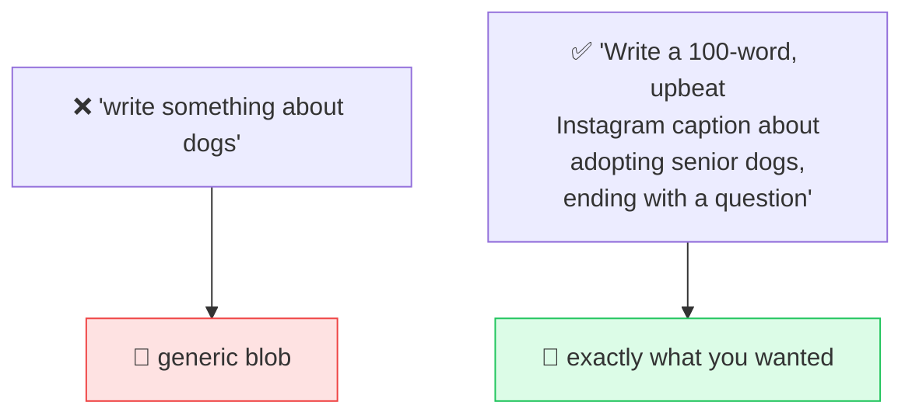

# 📐 Clear Instructions

> **🧒 Explain Like I'm 5:** Vague question, vague answer. Tell the AI exactly what you want — who it's for, how long, what shape — and you get exactly that.

## 🖼️ The Picture

## 🔧 How it actually works

The single biggest lever in prompting isn't a fancy technique — it's **specificity**. The model can't read your mind; it fills gaps with the "average" answer. Every detail you leave out is a decision you're handing to the machine.

A reliable checklist for any prompt: state the **task** (rewrite, summarize, generate), the **audience** (a 5-year-old, a CFO), the **format** (bullet list, table, JSON, 3 sentences), the **length**, the **tone** (formal, playful), and any **constraints** (no jargon, avoid these words). You don't need all six every time — just the ones that matter for your task.

Two more habits that help a lot: **put the instruction before the content** (models weight early instructions heavily), and **say what TO do, not just what to avoid** ("write in plain English" beats "don't be technical"). Clear prompting is just clear communication — the same skill that makes you good at briefing a coworker.

## 🌍 Real-world example

"Give me dinner ideas" → generic list. "Give me 3 vegetarian dinners I can cook in 20 minutes with chickpeas, no nuts, with a one-line shopping list each" → something you'd actually make tonight. Same model, far better prompt.

## 🔗 Related

- [Output Formatting](output-format.md)
- [Zero-Shot Prompting](zero-shot.md)
- [Iterative Refinement](iterative-refinement.md)
