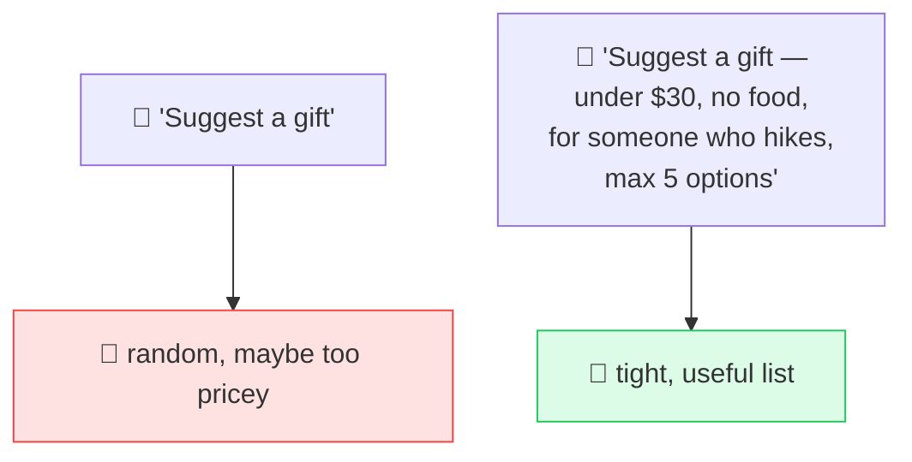

# 🚦 Constraints & Negatives

> **🧒 Explain Like I'm 5:** Draw the lines the AI can't cross — how long, what to avoid, what's off-limits — so it colors *inside* them.

## 🖼️ The Picture

## 🔧 How it actually works

**Constraints** are the boundaries you set on an answer: length ("max 100 words"), scope ("only cover Europe"), forbidden things ("no jargon, no emojis"), required things ("must include a code example"), and budget or count limits ("exactly 3 options"). They turn an open-ended request into a well-defined one — and well-defined requests get far more usable answers.

Two practical rules. First, **prefer positive framing**: "write in plain English" works better than "don't be technical," because models follow *do this* more reliably than *don't do that* — a negative still puts the forbidden idea in front of it. Use negatives for genuine hard limits ("never include personal data"), positives for everything else. Second, **state the most important constraint first** and keep the list short; a wall of 20 rules gets partially ignored.

When a constraint absolutely must hold (legal, safety, format for code to parse), reinforce it: put it in the [system prompt](system-prompt.md), repeat it at the end, and consider validating the output in code rather than trusting the model to never slip.

## 🌍 Real-world example

A tweet-writing tool appends "Hard rules: 280 characters max, no hashtags, one emoji only, friendly tone." The model stops producing essays-with-hashtags and starts producing tweets you can actually post.

## 🔗 Related

- [Clear Instructions](clear-instructions.md)
- [Output Formatting](output-format.md)
- [System Prompt](system-prompt.md)
