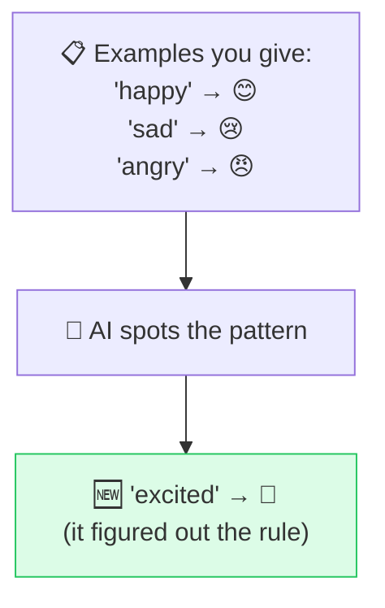

# 📚 Few-Shot Prompting

> **🧒 Explain Like I'm 5:** Show, don't tell. Give the AI two or three examples of what you want, and it copies the pattern for the rest.

## 🖼️ The Picture

A few examples teach the pattern better than a paragraph of instructions.

## 🔧 How it actually works

**Few-shot prompting** means including a handful of input→output examples *inside* your prompt before asking for the real thing. The model isn't being retrained — it's pattern-matching on the spot, using your examples as a live demonstration of the format, tone, and logic you want.

This shines when the task is **specific or unusual**: a custom output format, a niche classification, a particular writing style, or edge cases that are hard to describe in words. Two to five good examples usually beat a long-winded instruction. ("One-shot" is just few-shot with a single example.)

Tips that matter: make your examples **consistent in format** (the model copies structure religiously), **cover the tricky cases** you care about, and **keep the order sensible**. Watch out — examples eat up your [context window](https://github.com/behnia137/ai-for-beginners-visual/blob/main/concepts/context-window.md), and a biased set of examples will bias the output.

## 🌍 Real-world example

You want product reviews sorted into "Bug / Praise / Feature request." Instead of explaining the categories, you paste 3 labeled reviews, then a new one. The AI labels it correctly because it saw exactly what you meant.

## 🔗 Related

- [Zero-Shot Prompting](zero-shot.md)
- [Output Formatting](output-format.md)
- [Role Prompting](role-prompting.md)
