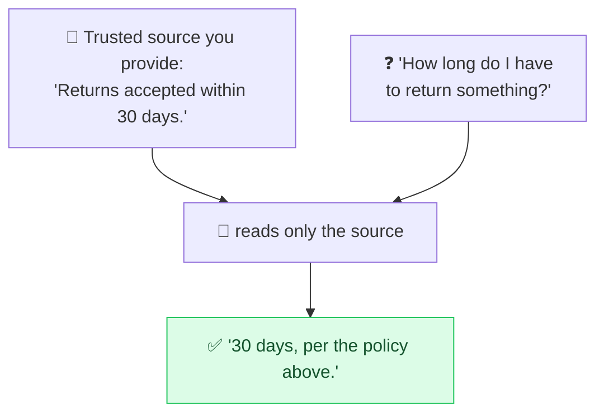

# 📖 Grounding (Answer from Context)

> **🧒 Explain Like I'm 5:** Hand the AI the exact text it should use, and tell it "answer only from this." Now it quotes the book instead of guessing from memory.

## 🖼️ The Picture

## 🔧 How it actually works

**Grounding** means giving the model the source material it should rely on — pasted text, search results, retrieved documents — and instructing it to answer *only* from that, not from its training memory. The prompt looks like: "Using ONLY the context below, answer the question. If the answer isn't in the context, say so." This is the prompting half of **RAG** (Retrieval-Augmented Generation).

It's the most reliable cure for [hallucinations](avoid-hallucination.md). Left to its memory, a model produces *plausible* answers that may be wrong or out of date. Anchored to real text, it has the actual facts in front of it — so answers become accurate, current, and *checkable*. Ask it to **quote or cite** the supporting line ("include the exact sentence you used") and you can verify every claim at a glance.

A few keys to doing it well: wrap the source in [delimiters](delimiters.md) so it's clearly *data, not instructions*; explicitly **allow "not found in the context"** so the model doesn't fill gaps by inventing; and keep the context relevant and not bloated, since everything competes for room in the context window. For live or external facts, combine grounding with [ReAct](react.md) so the model fetches the source first, then answers from it.

## 🌍 Real-world example

A company help-bot retrieves the 3 most relevant support articles, pastes them into the prompt, and says "answer using only these articles; cite the title you used." Customers get correct, up-to-date answers with a source — instead of a confident guess about a policy that changed last year.

## 🔗 Related

- [Avoiding Hallucinations](avoid-hallucination.md)
- [ReAct](react.md)
- [Delimiters & Structure](delimiters.md)
