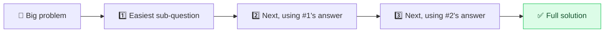

# 🧗 Least-to-Most Prompting

> **🧒 Explain Like I'm 5:** Solve the easy little pieces first, then use those answers to climb up to the hard one, like building a tower one block at a time.

## 🖼️ The Picture

## 🔧 How it actually works

**Least-to-most prompting** breaks a hard problem into a ladder of sub-problems ordered from *easiest to hardest*, then solves them in sequence, each answer feeding the next. The model first *decomposes* the question ("what smaller problems must I solve, and in what order?"), then *conquers* them one by one.

It differs from plain [chain-of-thought](chain-of-thought.md) in that the breakdown is explicit and ordered: you're not just thinking aloud, you're building a staircase. This matters for problems where later steps genuinely depend on earlier results, multi-part math, multi-hop questions, anything where "you can't do step 3 until you know step 1." It also generalizes better to harder versions of the same problem.

You can run it as one prompt ("First list the sub-problems from simplest to hardest, then solve each in order, using earlier answers") or as a [prompt chain](prompt-chaining.md) with a call per step. When a model keeps fumbling a complex question by trying to do it all at once, this is often the fix.

## 🌍 Real-world example

For a word problem like "A store gives 20% off, then 10% off the discounted price, on a $50 item, final price?", the model first solves "20% off $50 = $40", then "10% off $40 = $36", easy rung, then the next, instead of botching both discounts in one leap.

## 🔗 Related

- [Chain-of-Thought](chain-of-thought.md)
- [Prompt Chaining](prompt-chaining.md)
- [Step-Back Prompting](step-back.md)
