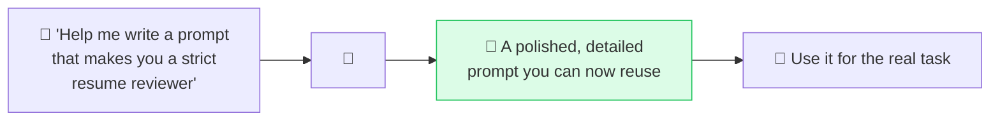

# 🪞 Meta-Prompting

> **🧒 Explain Like I'm 5:** Stuck on how to ask? Ask the AI to write the question *for* you. It's great at making better prompts than you'd write yourself.

## 🖼️ The Picture

## 🔧 How it actually works

**Meta-prompting** is using the AI to improve your prompting — prompting *about* prompts. Instead of struggling to phrase the perfect request, you ask the model to write or refine it: "Write me an expert prompt that will get the best résumé feedback," or "Here's my prompt — point out what's vague and rewrite it to be clearer."

It works because models have read countless high-quality prompts and know what good ones contain (clear role, task, format, constraints, examples). They're often better at *articulating* a request than you are in the moment — especially for unfamiliar domains where you don't know what details matter. It's a shortcut to many of the other techniques in this repo at once.

Three handy moves: **generate** ("write a prompt that does X"), **critique** ("what's weak about this prompt?"), and **upgrade** ("rewrite this to be more specific and add an output format"). For repeat tasks, do this once, then save the polished result as a reusable [template](prompt-templates.md).

## 🌍 Real-world example

You want great Midjourney-style image prompts but don't know the lingo. You ask, "Act as a prompt engineer for image models — turn 'cozy coffee shop' into a detailed prompt with style, lighting, and camera terms." The AI hands you a pro-level prompt you'd never have written cold.

## 🔗 Related

- [Iterative Refinement](iterative-refinement.md)
- [Prompt Templates](prompt-templates.md)
- [Clear Instructions](clear-instructions.md)
