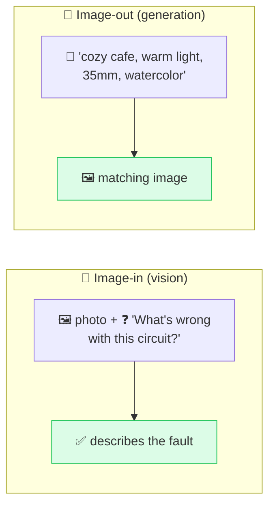

# 🖼️ Multimodal Prompting

> **🧒 Explain Like I'm 5:** You don't have to use only words. Show the AI a picture, or *describe* the picture you want — and the same prompting skills still apply.

## 🖼️ The Picture

## 🔧 How it actually works

**Multimodal prompting** is prompting with more than text — feeding the model images (and increasingly audio or video), or asking it to *produce* images. It splits into two everyday cases: **vision** (you give a picture and ask about it) and **generation** (you describe a picture and the model makes it).

For **vision models**, the same rules from this repo carry over: be specific about what you want ("describe the chart's trend and name the highest bar"), assign a [role](role-prompting.md) ("you are a radiologist reviewing this scan"), and ask for a [format](output-format.md) ("list each issue as a bullet"). You can even point at regions ("focus on the top-left") or combine an image with [few-shot](few-shot.md) text examples.

For **image generation** (Midjourney, DALL·E, Stable Diffusion, etc.), the prompt is a *description recipe*. The reliable ingredients: **subject** (what), **style** (watercolor, photoreal, 3D), **lighting** (golden hour, neon), **composition / camera** (close-up, wide, 35mm), and **mood**. Many tools also support **negative prompts** — listing what to *exclude* ("no text, no extra fingers"), the same [constraints](constraints.md) idea applied to pixels. Iterate just like with text: generate, see what's off, refine one detail at a time.

## 🌍 Real-world example

A seller photographs a vintage chair and asks a vision model "write an eBay listing from this photo: style, era, condition, and 3 keywords." Then, for the banner, they prompt an image model: "minimalist product shot of a mid-century chair, soft studio lighting, white background, no text." Two modalities, one workflow.

## 🔗 Related

- [Clear Instructions](clear-instructions.md)
- [Constraints & Negatives](constraints.md)
- [Iterative Refinement](iterative-refinement.md)
