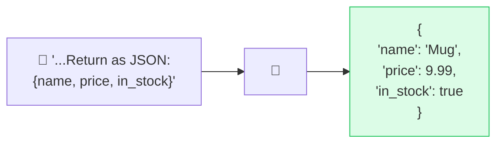

# 🧾 Output Formatting

> **🧒 Explain Like I'm 5:** Tell the AI what *shape* you want the answer in — a list, a table, JSON — and it pours the answer into that mold.

## 🖼️ The Picture

Ask for a specific structure and the AI fills it in.

## 🔧 How it actually works

By default the AI answers in prose. But if you need a **specific structure** — a table, a numbered list, Markdown, CSV, or JSON your code can parse — you have to *ask for it explicitly*. The clearer the mold, the more reliably the model fills it.

Two powerful tricks: **show a template** ("Return exactly this format: `Name: ___ / Score: ___`"), and for machine-readable output, **specify the schema** and ask for "JSON only, no explanation." Combining this with [few-shot](few-shot.md) examples makes structured output rock-solid, because the model copies your example's structure precisely.

This is the backbone of using AI inside real software: if your app expects JSON and the model returns a chatty paragraph, the code breaks. Formatting instructions turn a creative writer into a predictable component. (Many APIs now offer a "structured output" or "JSON mode" setting that enforces this even harder.)

## 🌍 Real-world example

A travel app asks the model to extract flight details from a messy confirmation email and "return JSON with departure, arrival, and flight_number." The clean JSON drops straight into the app's database — no human cleanup needed.

## 🔗 Related

- [Clear Instructions](clear-instructions.md)
- [Few-Shot Prompting](few-shot.md)
- [Delimiters & Structure](delimiters.md)
