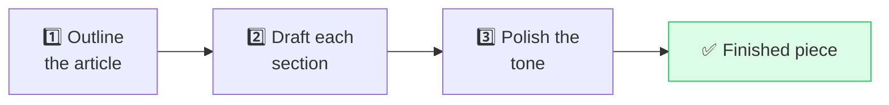

# ⛓️ Prompt Chaining

> **🧒 Explain Like I'm 5:** Don't ask for everything at once. Break a big job into small steps, and feed each answer into the next question.

## 🖼️ The Picture

Each step's output becomes the next step's input.

## 🔧 How it actually works

**Prompt chaining** means splitting a complex task into a sequence of smaller prompts, where each step's output feeds the next. Instead of one giant "do everything" prompt, you build a little assembly line: extract → transform → format, or outline → draft → edit.

It works because models do each *focused* step more reliably than one overloaded mega-task. Smaller steps are easier to get right, easier to debug (you can see exactly which link failed), and easier to mix and match. You can even use different settings per step — creative for brainstorming, precise for formatting.

This is the backbone of most real AI apps and [AI agents](https://github.com/behnia137/ai-for-beginners-visual/blob/main/concepts/ai-agent.md): a research assistant might chain "search → read results → summarize → draft answer → add citations." When a multi-step prompt keeps dropping requirements, chaining is usually the fix — give the model one clear job at a time.

## 🌍 Real-world example

A blog tool first asks the AI for a 5-point outline, lets you tweak it, then asks it to write each section using your approved outline, then runs a final "tighten this and fix the tone" pass. Three clean steps beat one messy "write me a blog post."

## 🔗 Related

- [ReAct](react.md)
- [Chain-of-Thought](chain-of-thought.md)
- [Iterative Refinement](iterative-refinement.md)
