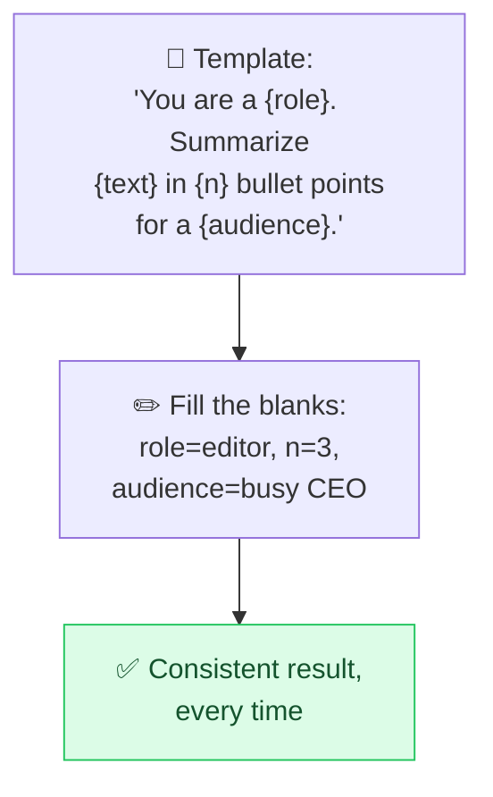

# 🧱 Prompt Templates

> **🧒 Explain Like I'm 5:** Write your best prompt once, leave blanks to fill in, and reuse it forever — like a form letter where you just swap the name.

## 🖼️ The Picture

## 🔧 How it actually works

A **prompt template** is a reusable prompt with **placeholders** (`{variable}`) for the parts that change. You craft a high-quality prompt once — with a clear role, task, format, and constraints baked in — then just swap the variables for each new use. It's the difference between rewriting a good prompt from scratch every time and pressing a reliable button.

The payoff is **consistency and scale**. The same template produces the same *quality* and *structure* across hundreds of inputs — essential when an app calls the model repeatedly, or when a team wants everyone's outputs to match. It also makes prompts **maintainable**: improve the template in one place and every use gets better instantly.

Good templates separate the **fixed instructions** (role, rules, output format) from the **variable content** (the user's text), and wrap the variable part in [delimiters](delimiters.md) so it can't hijack the instructions. Build your library by saving prompts that worked, ideally polished via [meta-prompting](meta-prompting.md) — a "summarizer," a "rewriter," a "classifier" you can grab anytime.

## 🌍 Real-world example

A support team keeps one template: "You are a friendly Acme agent. Reply to this customer message `{message}` in under 80 words, apologize if they're upset, and end with a next step." Every agent drops in the message and gets an on-brand draft — no one reinvents the prompt.

## 🔗 Related

- [Meta-Prompting](meta-prompting.md)
- [Delimiters & Structure](delimiters.md)
- [Output Formatting](output-format.md)
