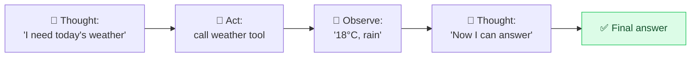

# 🔁 ReAct (Reason + Act)

> **🧒 Explain Like I'm 5:** The AI thinks a little, *does* something (like a web search), looks at what it got back, then thinks again — repeating until it's done.

## 🖼️ The Picture

Loop: Think → Act → Observe → repeat.

## 🔧 How it actually works

**ReAct** stands for **Rea**soning + **Act**ing. It's a prompting pattern that interleaves *thinking* with *doing*: the model writes a thought, takes an action (search the web, run code, call a tool, query a database), reads the result, and uses it to decide the next thought — looping until it reaches an answer.

This breaks the model out of its biggest limitation: it normally only knows what's in its training data and your prompt. By letting it *act* on the world and *observe* real results, ReAct grounds its answers in fresh, true information — dramatically reducing [hallucinations](avoid-hallucination.md) on questions that need current or external facts.

ReAct is the beating heart of **AI agents**. When you hear about an AI that can "use tools," "browse the web," or "take actions," there's almost always a Think→Act→Observe loop underneath. The prompt structures the loop; the tools give it hands.

## 🌍 Real-world example

You ask an AI assistant "What's the cheapest flight to Tokyo next month?" It thinks, searches a flights API, reads the results, notices it needs a return date, asks you, searches again, then answers — instead of inventing a price from memory.

## 🔗 Related

- [Prompt Chaining](prompt-chaining.md)
- [Chain-of-Thought](chain-of-thought.md)
- [Avoid Hallucinations](avoid-hallucination.md)
