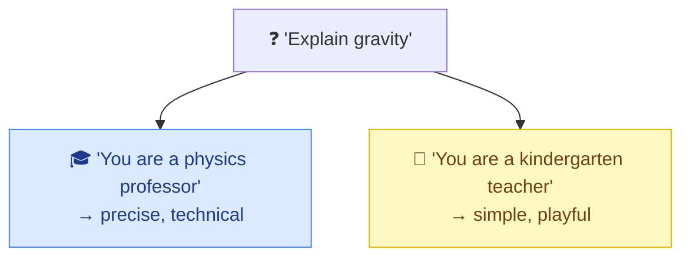

# 🎭 Role Prompting

> **🧒 Explain Like I'm 5:** Give the AI a job title before you ask. "You are a patient math tutor" gets you a very different answer than "You are a stand-up comedian."

## 🖼️ The Picture

Same question, different hat → different answer.

## 🔧 How it actually works

**Role prompting** (or "persona prompting") means telling the AI *who to be* before telling it what to do: "You are an experienced copy editor," "Act as a senior Python developer," "You are a friendly customer-support agent." This sets the tone, vocabulary, depth, and priorities of the response in one short phrase.

It works because the model has read enormous amounts of writing *by* doctors, lawyers, teachers, marketers, and engineers. Naming a role steers it toward that slice of its training — the right jargon, the right level of detail, the right assumptions. It's a high-leverage line: a few words reshape the whole answer.

Pair the role with a **goal and an audience** for best results: "You are a tax accountant explaining deductions to a freelancer with no finance background." Roles are often placed in the [system prompt](system-prompt.md) so they apply to the whole conversation, not just one message.

## 🌍 Real-world example

A customer-service chatbot that opens with "You are a calm, empathetic support agent for an airline" stays polite and on-brand even when a frustrated traveler is shouting in all caps — because the role anchors its behavior.

## 🔗 Related

- [System Prompt](system-prompt.md)
- [Clear Instructions](clear-instructions.md)
- [Few-Shot Prompting](few-shot.md)
