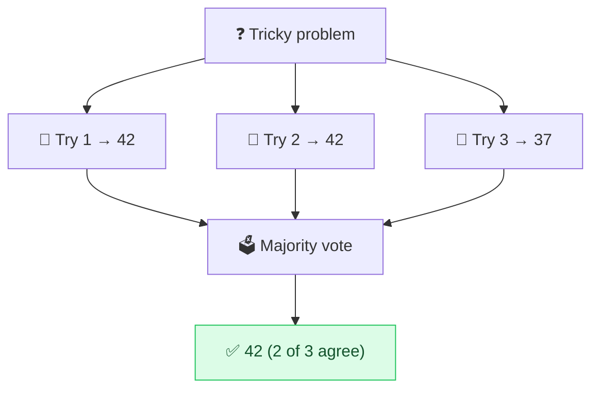

# 🗳️ Self-Consistency

> **🧒 Explain Like I'm 5:** Ask the same hard question a few times, then go with the answer that shows up most — like polling your friends and trusting the majority.

## 🖼️ The Picture

## 🔧 How it actually works

**Self-consistency** builds on [chain-of-thought](chain-of-thought.md). Instead of trusting a single reasoning path, you ask the model to solve the *same* problem several times (with some randomness, via a higher [temperature](https://github.com/behnia137/ai-for-beginners-visual/blob/main/concepts/temperature.md)), each time reasoning independently. Then you take the **most common final answer**.

The logic: there are many wrong ways to reason but they tend to disagree with each other, while correct reasoning paths tend to converge on the same answer. So the answer that shows up most often across attempts is usually the right one. It's an "ask the crowd, then vote" strategy applied to a single model.

The cost is obvious — running the prompt N times is N times more expensive and slower. So save it for **high-stakes or notoriously tricky** questions (hard math, logic puzzles, careful classification) where one extra shot of accuracy is worth the spend, not for everyday queries.

## 🌍 Real-world example

A homework-help tool runs a difficult algebra problem five times behind the scenes, sees "x = 4" come back three times and "x = 6" twice, and confidently shows the student "x = 4" — quietly filtering out the unlucky wrong attempts.

## 🔗 Related

- [Chain-of-Thought](chain-of-thought.md)
- [Iterative Refinement](iterative-refinement.md)
- [Avoid Hallucinations](avoid-hallucination.md)
