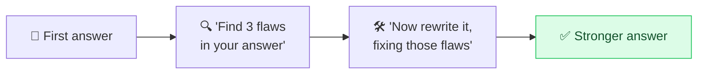

# 🔍 Self-Critique & Reflection

> **🧒 Explain Like I'm 5:** Ask the AI to grade its own homework and fix the mistakes before handing it in. It's a surprisingly good editor of its own work.

## 🖼️ The Picture

## 🔧 How it actually works

**Self-critique** (a.k.a. *reflection* or *self-refine*) asks the model to review its own output, identify weaknesses, and then improve it, all in the same session. The pattern is *generate → critique → revise*: "Here's your draft. List its biggest problems. Now rewrite it addressing each one."

Why it helps: producing a first answer and *judging* an answer are different skills, and models are often better critics than first-try authors. When asked to hunt for flaws, the model engages a more careful, analytical mode and catches errors, gaps, and weak arguments that its initial pass glossed over, then folds the fixes back in. It's [iterative refinement](iterative-refinement.md) where the *model itself* supplies the feedback instead of you.

Make the critique **concrete and criteria-based** for best results: "Check for factual errors, unclear sentences, and missing counterarguments," not just "make it better." A loop of generate→critique→revise can run a couple of rounds, but watch diminishing returns, and remember a confident model can also "approve" its own [hallucinations](avoid-hallucination.md), so self-critique reduces errors, it doesn't guarantee truth.

## 🌍 Real-world example

A coding assistant writes a function, then is prompted "review this for bugs and edge cases, then post a corrected version." It spots an unhandled empty-list case it missed the first time and ships the fixed code, without you having to find the bug yourself.

## 🔗 Related

- [Iterative Refinement](iterative-refinement.md)
- [Self-Consistency](self-consistency.md)
- [Avoiding Hallucinations](avoid-hallucination.md)
