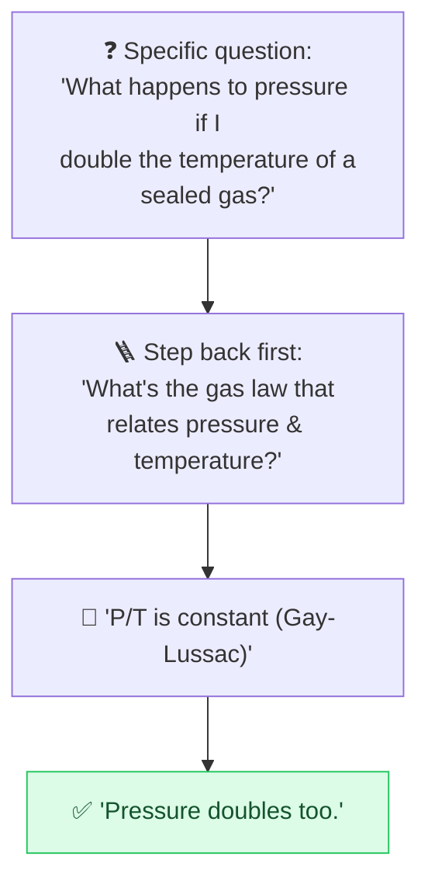

# 🪜 Step-Back Prompting

> **🧒 Explain Like I'm 5:** Before solving the exact question, ask the AI the *bigger, simpler* version first. Get the principle straight, then the specific answer comes out right.

## 🖼️ The Picture

## 🔧 How it actually works

**Step-back prompting** tells the model to first answer a more *general* question — the underlying principle, rule, or category — before tackling the specific one. You "step back" to the big picture, then zoom in. It's a two-stage move: derive the concept, then apply it.

It helps because models often stumble on a specific case while knowing the general rule perfectly well. By surfacing the principle first ("What's the relevant law/definition/framework here?"), you give the model solid ground to stand on, and the detailed answer follows more reliably. It's especially good for science, math, history, and "why" questions where a known principle drives the specifics.

You can do it in one prompt — "First state the general principle that applies, then use it to answer the question" — or as two chained steps. It pairs naturally with [chain-of-thought](chain-of-thought.md): step back for the principle, then reason step by step from it.

## 🌍 Real-world example

Asked "Why did this specific 2008 bank fail?", a step-back prompt first has the AI explain *how* bank runs and leverage generally cause failures, then maps that framework onto the specific bank — producing a clearer, less hand-wavy answer than diving straight into details.

## 🔗 Related

- [Chain-of-Thought](chain-of-thought.md)
- [Least-to-Most](least-to-most.md)
- [Clear Instructions](clear-instructions.md)
