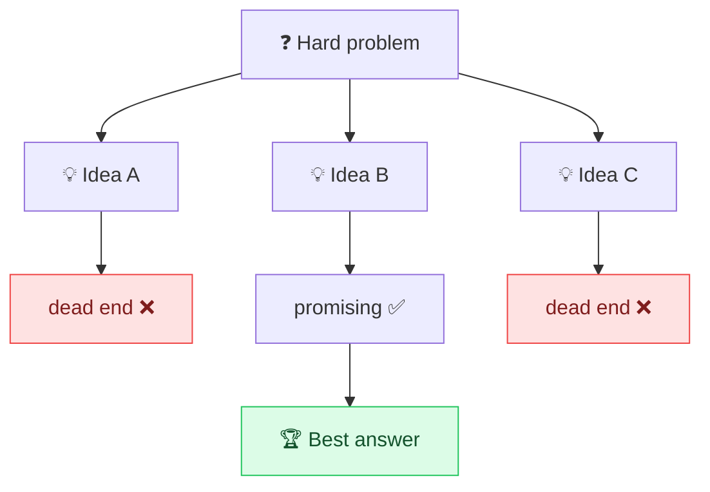

# 🌳 Tree of Thoughts

> **🧒 Explain Like I'm 5:** Instead of guessing one path and hoping it's right, the AI explores several ideas at once, like trying every branch of a maze and keeping the one that leads out.

## 🖼️ The Picture

## 🔧 How it actually works

**Tree of Thoughts (ToT)** extends [chain-of-thought](chain-of-thought.md) from a single line of reasoning to a *branching tree* of them. At each step, the model generates several possible next thoughts, evaluates which look promising, and explores those further, backtracking from dead ends instead of being stuck with its first guess.

The big idea is **deliberate exploration**. A normal chain commits to one path; if step 2 goes wrong, the whole answer is doomed. A tree lets the model say "this branch looks weak, let me try another," much like a human weighing options before committing. It's most useful for problems with many possible approaches, puzzles, planning, creative strategy, math with multiple routes.

The cost is real: exploring and scoring many branches means many more model calls, so it's slower and pricier. You usually orchestrate it in code (generate → evaluate → expand the best), not in a single prompt. Reach for it on genuinely hard problems where one-shot reasoning keeps failing.

## 🌍 Real-world example

An AI planning a 3-day trip sketches three different itineraries (beach-focused, museum-focused, food-focused), quickly judges each against your budget and time, drops the two that don't fit, and develops the winner in detail, instead of railroading you into its first idea.

## 🔗 Related

- [Chain-of-Thought](chain-of-thought.md)
- [Self-Consistency](self-consistency.md)
- [Least-to-Most](least-to-most.md)
