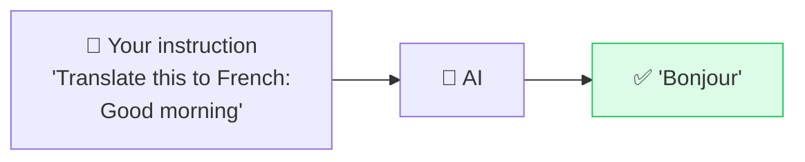

# 🎯 Zero-Shot Prompting

> **🧒 Explain Like I'm 5:** Just *ask*. No examples, no setup — like asking a smart friend a question and trusting they already know enough to answer.

## 🖼️ The Picture

No examples needed — the model already learned the task during training.

## 🔧 How it actually works

**Zero-shot prompting** means you give the AI a task with *zero* examples of how to do it — you rely entirely on what it learned during training. Modern models have seen so much text that for common tasks (translate, summarize, classify, rewrite) they don't need a demonstration. You just describe what you want.

It's the simplest, fastest, cheapest approach — fewer [tokens](https://github.com/YOUR_GITHUB_USERNAME/ai-for-beginners-visual/blob/main/concepts/token.md) means lower cost and quicker answers. Start here for *every* task. Only reach for [few-shot](few-shot.md) or fancier techniques when zero-shot gives shaky or inconsistent results.

The trick to good zero-shot prompts is **clarity**: name the task, the format you want, and any constraints. "Summarize" is okay; "Summarize this in 3 bullet points for a busy manager" is much better.

## 🌍 Real-world example

Typing "rewrite this email to sound friendlier" into ChatGPT and getting a clean result with no setup — that's zero-shot. You didn't show it examples of friendly emails; it just knew.

## 🔗 Related

- [Few-Shot Prompting](few-shot.md)
- [Clear Instructions](clear-instructions.md)
- [Chain of Thought](chain-of-thought.md)
